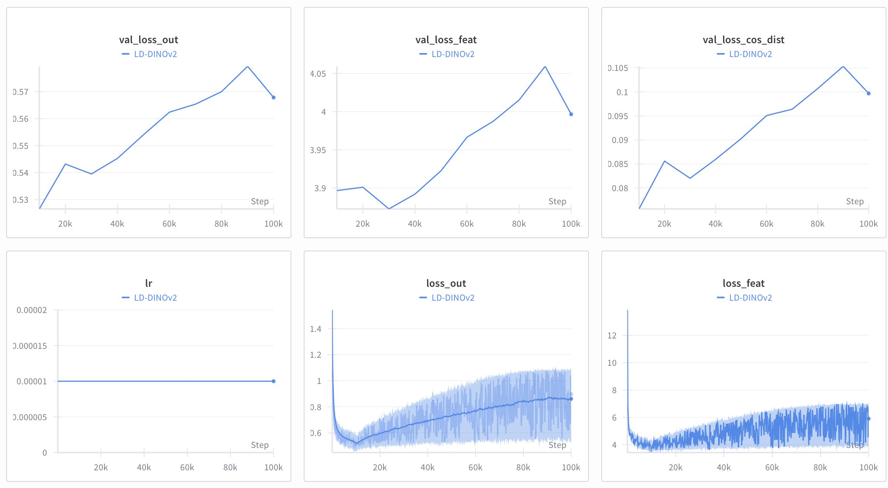
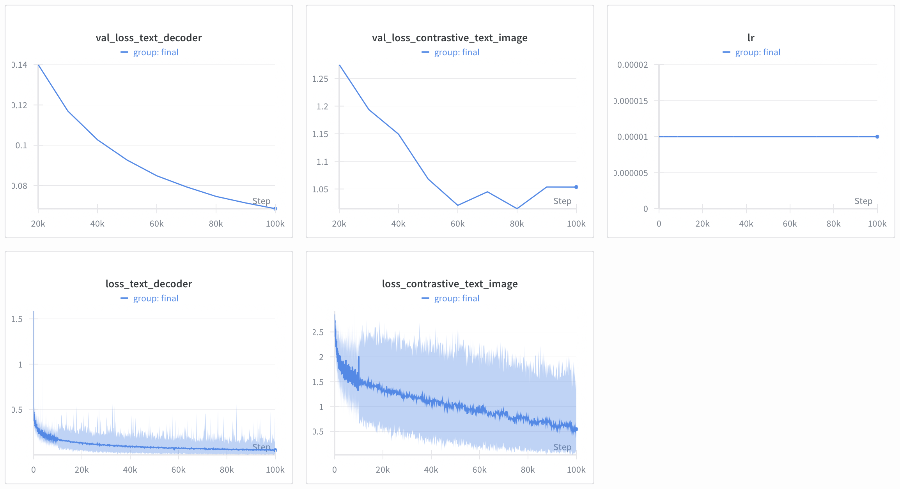
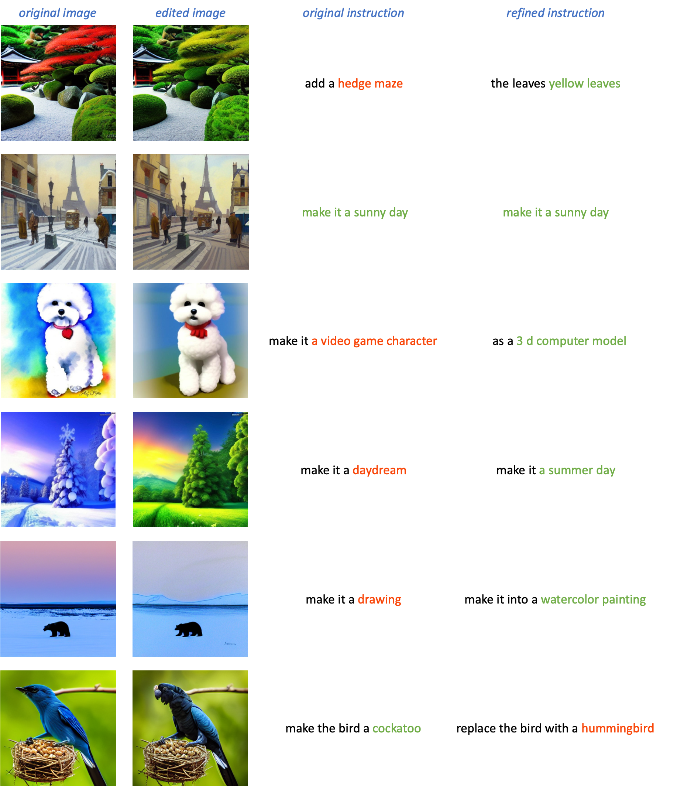
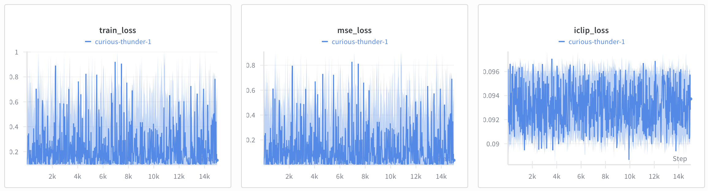

# InstructCLIP: Improving Instruction-Guided Image Editing with Automated Data Refinement Using Contrastive Learning

Reprodcution of InstructCLIP (Chen *et. al*, CVPR 2025).

## Environment
Clone this repo:

```bash
git clone git@github.com:vwOvOwv/Multimodal-Learning-2025-Fall-Project.git
```

Build dependencies:

```bash
conda create -n iclip python=3.10 -y
conda activate iclip
pip install -r requirements.txt
```

We have modified `requirement.txt` to remove conflicting packages or packages that are not used.

Install FlashAttention manually [here](https://github.com/Dao-AILab/flash-attention/releases/download/v2.8.3/flash_attn-2.8.3+cu12torch2.4cxx11abiFALSE-cp310-cp310-linux_x86_64.whl).

## Image Editing Instruction Refinement

### Data Preparation
Download [timbrooks/instructpix2pix-clip-filtered](https://huggingface.co/datasets/timbrooks/instructpix2pix-clip-filtered) to a new folder `instructclip_datasets`. This is the training data for both LD-DINOv2 and InstructCLIP. Also, download [ip2p_clip_feat.npy](https://www.dropbox.com/scl/fo/id2ow98wqhc38x6csjmxe/AC3SmN-0klY-C6yuZMSd_ic?rlkey=o7mmbh1x60br2y8l3fas2eag2&st=22mqu2si&dl=0) to the same folder. It contains the CLIP text features of all edit instruction in the InstructPix2Pix dataset, which we will use to refine edit instructions later. The dataset folder should look like this:
```
instructclip_datasets
├── instructpix2pix-clip-filtered
│   ├── dataset_dict.json
│   └── train
└── ip2p_clip_feat.npy
```

### LD-DINOv2 Training 

To train LD-DINOv2, run the following command, which save checkpoints in `ckpts/lddinov2` by default:
```bash
bash scripts/train_lddinov2.sh
```

Below are reproduced training curves of LD-DINOv2:



### Instruct-CLIP Training

To train Instuct-CLIP, run the following command, which load the latest LD-DINOv2 checkpoint from `ckpts/lddinov2/final.ckpt` and save its checkpoints in `ckpts/instructclip` by default:
```bash
bash scripts/train_iclip.sh
```

Below are reproduced training curves of Instruct-CLIP:


### Edit Instruction Refinement

After training, to get the edit instruction from an image pair, run:
```bash
python get_edit_instruction.py --input_path <input_path> --output_path <output_path>
```

Below are reproduced refinement examples:



## Image Editing

### Data Preparation with Refined Instructions
The authors provide over 120K samples with refined editing instructions [here](https://huggingface.co/datasets/SherryXTChen/InstructCLIP-InstructPix2Pix-Data). Download it to `instructclip_datasets` as well. Now the folder should look like this:
```
├── InstructCLIP-InstructPix2Pix-Data
│   ├── dataset_dict.json
│   └── train
├── instructpix2pix-clip-filtered
│   ├── dataset_dict.json
│   └── train
└── ip2p_clip_feat.npy
```

### Training

Instruct-CLIP is needed for fine-tuning our image editing models. To fine-tune InstructPixPix on our dataset, run the following command where the checkpoints are stored in `ckpts/ip2p_finetuned` by default:
```bash
bash train_instruct_pix2pix.sh
```

Below are reproduced fine-tuning curves:

